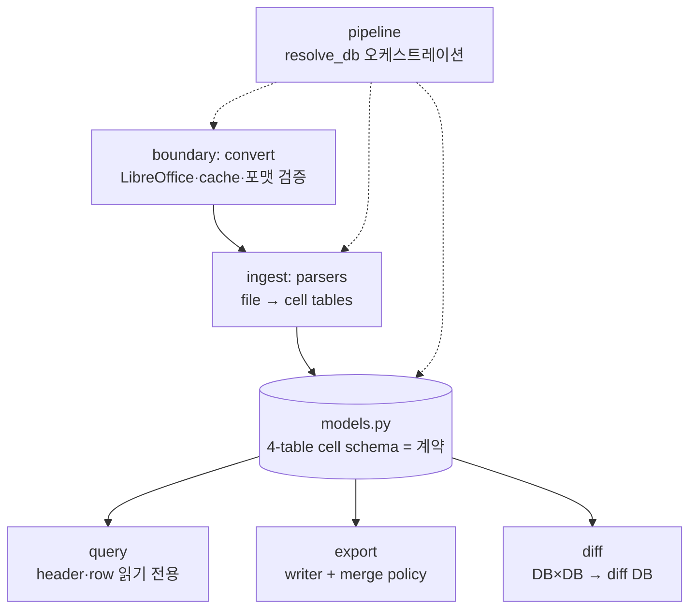

# 아키텍처 제안 — DB 중심 허브-스포크 구조 명시화

이 코드는 이미 "cell DB가 계약(hub)"인 허브-스포크 구조를 암묵적으로 갖고 있다.
아키텍처를 새로 발명할 필요는 없다. 필요한 일은 두 가지다.
그 구조를 모듈 경계로 명시하고, 구조를 어기는 세 곳을 정리한다.

## Status

반영 완료 (2026-06-13, v0.5.0 기준 코드에 적용). 구 모듈 경로
(`helpers`, `convert`, `xlsx_parser`, `xls_parser`, `exporter`) 는 제거 —
하위 호환 shim 없이 새 경로만 제공한다 (breaking change, 배포 시 bump 필요).
미결정 1건 — [docstring 정책](#미결정-1--docstring-정책).
[xls_parser 존속](#미결정-2--xls_parser-존속-결정됨)은 유지로 결정.

## Context — 현재 구조 진단

데이터는 이미 한 방향으로 흐른다.
파일 → 변환/검증 → 파싱 → **cell DB** → 조회 → diff/merge → export.
모든 단계가 `models.py`의 4-table 스키마를 계약으로 공유한다.
이 흐름은 "도메인 경계에서는 DB가 계약" 원칙과 일치한다.

구조를 어기는 곳은 세 군데다.

| 위치 | 문제 |
|---|---|
| `helpers.py` | 읽기 헬퍼(header 탐지, row 순회)와 merge-write 정책(export 시점에 `Worksheet`를 변형)이 한 파일에 섞임 |
| `convert.py` `resolve_db` | 파일 변환 유틸 모듈이 parser·models를 역으로 import하며 전체 파이프라인을 오케스트레이션 — 의존 방향 역전 |
| `xls_parser.py` | xlsx 경로와 중복된 두 번째 입력 경로. merge 처리를 손으로 다시 구현하고 `MergeResolver`를 재사용하지 않음 |

## Decision — 제안 아키텍처

레이어를 다섯 개로 나눈다. boundary, ingest, 계약(models), 소비자(query/export/diff),
pipeline.



모듈 배치:

```
xp_excel_toolkit/
├── models.py        # 계약. 지금 그대로
├── config.py        # 전역 설정 (CACHE_DIR, LIBREOFFICE_PATH) — 계약층 부속
├── merge.py         # MergeResolver — models만 의존하는 계약층 부속 유틸
│                    #   (from_worksheet / from_db / from_bounds 3개 생성 경로)
├── ingest/
│   ├── convert.py   # LibreOffice + cache (resolve_db 제외)
│   ├── xlsx.py      # 현재 xlsx_parser
│   └── xls.py       # bulk insert + MergeResolver.from_bounds로 xlsx와 패턴 통일
├── pipeline.py      # resolve_db — 유일하게 전 레이어를 아는 진입점
├── query.py         # find_header_row_db, iter_rows_by_header
├── export/
│   ├── writer.py    # export_from_cells, apply_style
│   └── merge_policy.py  # MergeWriteConflict + 5개 policy
└── diff/            # 지금 그대로 (별도 DiffBase 유지)
```

의존 규칙은 한 줄이다.
**모든 레이어는 계약층(models·config·merge)만 import하고, 레이어끼리는 import하지
않는다. 예외는 pipeline 하나.**
같은 레이어 패키지(ingest/, export/, diff/) 내부의 형제 모듈 import는 허용한다.
boundary(convert)는 별도 디렉토리가 아니라 ingest 패키지 안의 첫 단계다 —
다이어그램의 boundary → ingest 화살표는 `ingest/xlsx.py` 가
`ingest/convert.py` 의 검증 함수를 쓰는 패키지 내부 흐름을 뜻한다.

## Rationale

현재 `resolve_db`는 함수 안에서 parser·models를 지연 import한다.
지연 import는 의존 규칙이 없어서 생긴 증상이다.
오케스트레이션을 `pipeline.py`로 빼면 지연 import가 사라진다.

`helpers.py`의 merge-write 정책은 export 시점 로직이다.
`resolve_conflicts`가 `Worksheet`를 직접 변형한다는 점이 근거다.
읽기 헬퍼와 분리하면 "query는 읽기 전용"이라는 레이어 성격이 선다.

`xls_parser`는 xlsx 경로와 같은 일을 다른 패턴으로 한다.
merge 처리를 손으로 구현하고, bulk insert 대신 cell마다 `session.add()`를 호출한다.
ingest 레이어로 묶고 패턴을 통일하면 유지보수 지점이 하나로 줄어든다.

## Consequences

긍정 — 레이어 경계가 import 규칙 하나로 검증 가능해진다.
신규 기여자는 "models만 보면 계약을 안다" 상태가 된다.
xls/xlsx 패턴 통일로 merge 버그 수정 지점이 하나로 줄어든다.

부정 — 공개 API 경로가 바뀐다 (`xp_excel_toolkit.helpers` →
`xp_excel_toolkit.query` 등).
devpi로 배포된 패키지라서 하위 호환 shim 또는 major bump가 필요하다.
`__init__.py` 재배치 비용도 든다.

반영 시 선택 — shim 없이 정리했다. 구 경로 5개는 삭제했고, 소비자는
새 경로(또는 동일하게 유지된 top-level `xp_excel_toolkit` re-export)로
이동해야 한다. top-level `__all__` 32개 심볼은 그대로라서, top-level
import만 쓰는 소비자는 영향이 없다. 그 외 비호환: `MergeResolver(ws)`
생성자는 `MergeResolver.from_worksheet(ws)` 로 바뀌었다 (부록 3번 항목).
LibreOffice stderr 경고 print 는 `warnings.warn` 으로 바꿨고,
`on_progress` 부재 시 print fallback 은 침묵으로 바꿨다.

## 부록 — 구조와 별개인 코드 수준 정리 대상 (5건 모두 반영됨)

| 위치 | 문제 | 처리 |
|---|---|---|
| `xls_parser.py:156` | cell마다 `session.add()` 루프 | `BULK_CHUNK=500` bulk insert로 전환 (xlsx 쪽과 통일) |
| `xls_parser.py:18-75` | `_extract_style_xls`의 try/except AttributeError 4중첩 | `getattr(x, attr, default)`로 대체 |
| `merge.py:49` | `from_db`가 `cls.__new__(cls)`로 `__init__` 우회 | `__init__`은 데이터를 받고, `from_worksheet`/`from_db` classmethod가 데이터 준비 |
| `convert.py:188-191` | `on_progress`, `import_fn` 타입 힌트 없음 | 반영: `on_progress` 는 `Callable[[str], None] \| None`, `import_fn` 은 keyword 인자를 표현하는 `ImportFn` Protocol (`pipeline.py`) |
| `convert.py` 외 | `on_progress` 부재 시 `print()` fallback | 라이브러리는 stdout을 만지지 않는다 — `None`이면 침묵 |

## 미결정 1 — docstring 정책

코드 스타일 룰 기본값은 docstring 0개다.
단, 이 패키지는 devpi로 배포되어 도메인 패키지들이 소비하는 라이브러리다.
라이브러리 예외 조항(계약상 docstring 필요)에 해당하는지 사용자 결정이 필요하다.
반영 시점에는 기존 docstring을 잠정 유지했다 — 제거로 결정되면 일괄 제거한다.

## 미결정 2 — xls_parser 존속 (결정됨)

유지로 결정 — LibreOffice 없는 환경 지원을 위해 `ingest/xls.py` 로 남긴다.
대신 xlsx 경로와 패턴을 통일했다: bulk insert (`BULK_CHUNK=500`),
`MergeResolver.from_bounds` 재사용, getattr 기반 style 추출.
같은 샘플 파일에서 xls/xlsx 두 경로가 동일한 cell/merge 수를 낸다.
